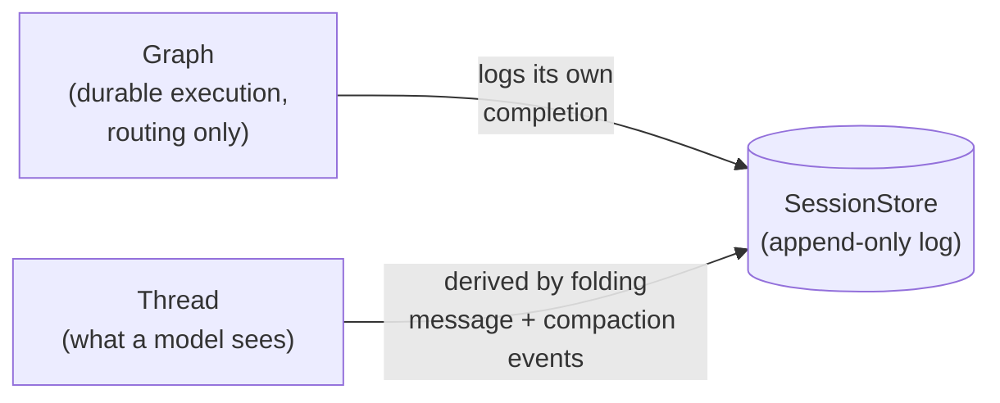

# Compaction redesign — overview

## Three separate things, three separate jobs

**The graph** — durable execution. Nodes, edges, routing. Its only question:
"which node runs next." Answered by `Emit`. Never knows about message
content.

**The thread** — agent/harness state. What a model sees (`messages`) and the
full record (`history`). A separate concept from the graph, not fused into
it — two different components on purpose.

**The session store** — the durable, append-only log everything gets written
to. The source of truth both the graph's position and the thread's content
get derived from.



## The public API, before and after

**`Emit`** — `compact` is removed; `Emit` becomes purely about routing:

```ts
// before
export type Emit<Result = unknown> =
  | { output: Result }
  | { compact: Message[]; meta?: unknown }
  | { invalidate: NodeId; threadAction: ThreadAction; reason?: Message }
  | { error: StepError };

// after
export type Emit<Result = unknown> =
  | { output: Result }
  | { invalidate: NodeId; threadAction: ThreadAction; reason?: Message }
  | { error: StepError };
```

**`StepContext.compact`** — stops returning an `Emit`, becomes an awaited
effect, same shape as `modelCall`/`callTool`/`appendEvent`:

```ts
// before
compact(replace: (messages: Message[]) => Promise<Message[]>, meta?: unknown): Promise<Emit<Message[]>>;

// after — same shape as the compaction event itself, not a generic transform.
// meta is dropped intentionally: nothing currently uses it.
compact(input: { task?: Message; summary: Message; keepLast: number }): Promise<void>;
```

The `compacts(replace, meta)` helper (a wrapper that built a whole step out
of a single `compact()` call) is removed — the new API always needs a
separate `output()` call afterward, so a one-line wrapper doesn't save much.

`invalidate` is untouched — stays its own `Emit` variant.

## `agentTurn`'s own wiring, before and after

**Before** — `fold` does two jobs at once (combine results, and force them
onto the thread via an unconditional `compact`):

```ts
const fold = flow.step(async (context) => {
  const toolMessage: Message = { role: "tool", content: results.map(...) };
  context.appendEvent({ message: toolMessage }, "message");
  return context.compact((messages) => Promise.resolve([...messages, toolMessage]));
});
fold.then(checkFinish);
```

**After** — `fold` only combines and logs; a new, separate,
`maybeCompact` step owns the actual (conditional) decision to compact:

```ts
const fold = flow.step(async (context) => {
  const toolMessage: Message = { role: "tool", content: results.map(...) };
  context.appendEvent({ message: toolMessage }, "message"); // no compact() call at all
  return context.output(true);
});

const maybeCompact = flow.step(async (context) => {
  const estimate = estimateTokens(context.thread.messages); // see "Decided" below
  const shouldCompact = overBudget(estimate);
  if (shouldCompact) {
    await context.compact({ summary: summarize(context.thread), keepLast: 10 });
  }
  return context.output(shouldCompact);
});

flow.entry(respond);
respond.then(each);
each.when(hasToolCalls, fold).otherwise(finalize);
fold.then(maybeCompact);      // <- new step sits here
maybeCompact.then(checkFinish);
checkFinish.when(winnerDefined, finishByTool).otherwise(respond);
```

`fold` never calls `compact` now. Compaction is entirely `maybeCompact`'s
job, and it's conditional — most turns, `shouldCompact` is `false` and
nothing happens.

## How `thread.messages` gets derived — concrete example

A compaction event doesn't carry a whole new message list — that would mean
duplicating content already sitting in `history`. Instead it carries a
compact instruction: an optional synthesized restatement of the task, a
synthesized summary of what's been done so far, and how many of the most
recent messages to keep verbatim (a count/pointer back into `history`, not
copied content):

```ts
{ type: "compaction", event: { task?: Message, summary: Message, keepLast: number } }
```

`task` and `summary` answer different questions: `task` restates the goal
(optional — not every conversation has one single ongoing goal worth
pinning); `summary` describes progress — what's been done so far. Deriving
`messages` on a `"compaction"` event means: insert whichever of `task`/
`summary` are present, then pull the last `keepLast` messages straight out
of `history`:

```
Full history, in order:
1. message    "Add authentication to the API"      (user)
2. message    "Sure, let me look at the routes"    (assistant)
3. message    "Here's what I found"                (user)
4. message    "Let me dig deeper"                  (assistant)
5. message    "Found it, here's why"                (user)
6. compaction { task: "Add authentication to the API",
                summary: "Explored the routes, found where auth is missing",
                keepLast: 2 }

thread.messages after event 6:
  [ task,                      // synthesized restatement of the goal, optional
    summary,                   // synthesized: what's been done so far
    history[4], history[5] ]   // last 2 messages before the compaction
```

`keepLast` is the expected, common case — a count, not an arbitrary list of
references. A later `"message"` event still just appends onto whatever this
produced, same as always.

Two things this changes from today, worth being explicit about: `history`
currently gets the *entire* compacted list appended to it on every
compaction (not just the new messages) — under this design, `history` is
just every `"message"` event in order, and `messages` is what gets derived
specially. And the `"compaction"` event's own on-disk shape changes
(`{ messages: [...] }` → `{ task?, summary, keepLast }`) — a breaking
change to the log format, not just the in-memory API.

## Forking

A fork starts as an exact copy of everything up to the fork point — messages
and compactions alike, since it's just copying the log up to that point.
Nothing special needed. (`parentThreadId` is unrelated — sub-agent spawning,
not forking.)

A `use` subgraph shares its parent's thread entirely (not a fork) — its
messages land in the same history as the outer flow's. `keepLast` there
means the same thing it means everywhere else: the last N messages across
the whole shared thread, not scoped to just the subgraph. No special-casing
needed.

## Position tracking stays a separate fix

Deriving `messages` from the log does **not**, by itself, fix replay losing
track of *which node* a session is at — that's the graph's problem, not the
thread's. A step's completion must always be recognizable by replay
regardless of what else it logged. Today that recognition comes only from a
proper `"output"` event (`applyOutputEvent`, keyed by `stepId`) — the old
`compact` branch skipped logging one.

That fix alone breaks the infinite loop, but doesn't restore correct
`thread.messages` content: replay still ignores `"compaction"` events
entirely. Both fixes are needed together — the step-completion fix (so
replay stops re-running the same step) and a new dispatch branch in
replay's own event handling for `"compaction"` events (so the derived
messages actually reflect the compaction once replay reconstructs from
scratch, not only mid-drive).

`invalidate` has the exact same gap, confirmed — and it's worse. Its own
`"invalidation"` event isn't recognized by replay either, so a step that
invalidates would be re-run the same way `fold` was. But re-running an
invalidation doesn't just duplicate a log line: it re-applies whatever
`threadAction` it carries (possibly `fork` or `reset`), actually mutating
thread state on every spurious re-entry. Needs its own fix, same shape as
`compact`'s.

## Decided

Real compaction is triggered by a dedicated step inside `agentTurn`'s own
loop — `maybeCompact`, sketched above. It runs after `fold`, before the loop
goes back to `respond`. Each turn, it checks the thread against a policy and
calls `compact()` only when that policy says to — most turns, nothing
happens.

The threshold check is an estimate over `thread.messages`, computed
independently of any model call:

```ts
const maybeCompact = flow.step(async (context) => {
  const estimate = estimateTokens(context.thread.messages);
  const shouldCompact = overBudget(estimate);
  if (shouldCompact) {
    await context.compact({ summary: summarize(context.thread), keepLast: 10 });
  }
  return context.output(shouldCompact);
});
```

Using an estimate rather than the model's own reported usage means this can
run right after a user message arrives, before ever calling the model — not
only after a reply.
