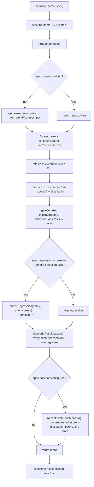
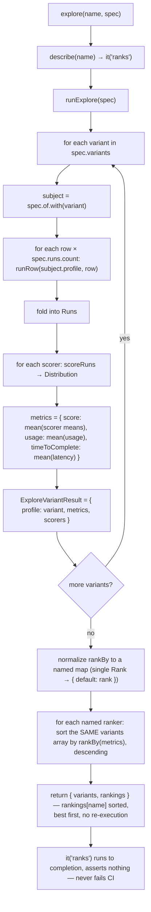
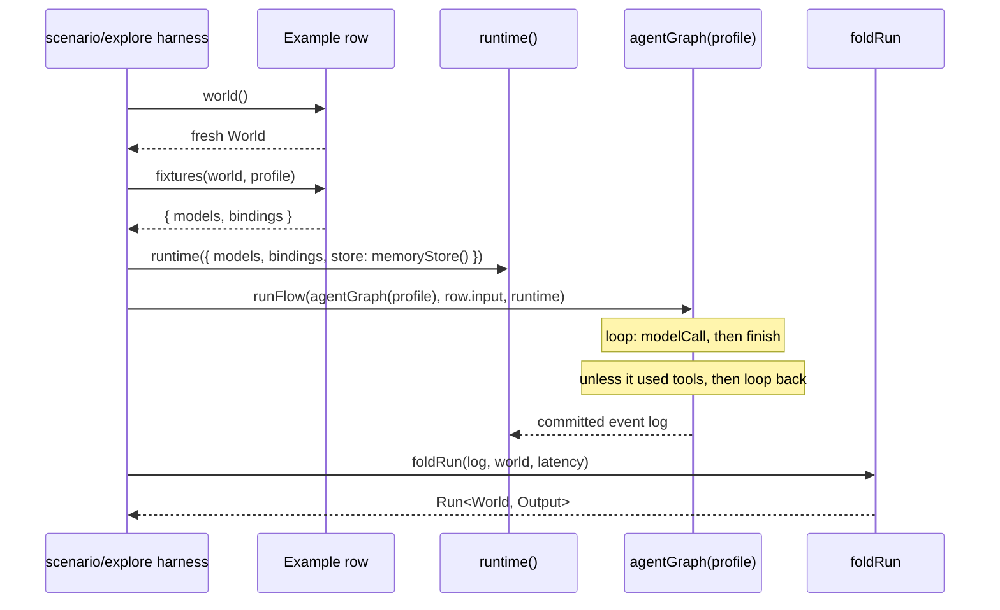

# Eval framework — public interface breakdown

Source of truth for this note: `.worktrees/testing-framework/src/testing/eval/**`, an unmerged
branch (`testing-framework`).
Never landed in `main`; `packages/testing` today has none of this.
This note exists to review the interface before reimplementing it — from scratch, in
`packages/testing` — rather than porting the branch as-is.

## Why it exists

`docs/learn/testing/evaluating-personas.md` (the shipped doc) teaches a manual pattern: a plain
array of cases, `it.each`, hand-written `check` functions, no aggregation.
That page says outright "there's no built-in eval framework." This branch is the framework that page
is the fallback for: two vitest-registering functions, `scenario` and `explore`, plus the
scorers/regression/ranking machinery they share.

## The two entry points

Both are thin wrappers: a `describe` block containing one `it`.
All real logic lives in a directly-testable core function (`runScenario` / `runExplore`) that the
`it` calls and asserts on.

|                  | `scenario(name, spec)`                   | `explore(name, spec)`                                    |
| ---------------- | ---------------------------------------- | -------------------------------------------------------- |
| Purpose          | Gate CI — did behaviour hold             | Compare variants — which is best                         |
| Variants         | One `Subject`                            | N variants of one `Agent`, via `grid()` or a manual list |
| Fails the test?  | Yes — `expect(result.passed).toBe(true)` | No — always green, `it("ranks", ...)` never asserts      |
| Output           | pass/fail + per-scorer `Distribution`    | variants sorted by a `Rank` function                     |
| Regression check | Optional, against a `BaselineStore`      | None                                                     |

## Core data shape: `Run<World, Output>`

Every scorer reads a `Run`, folded from one flow execution's committed event log (`foldRun` in
`src/testing/graph/run.ts`, already shipped — not part of this branch):

```ts
interface Run<World = unknown, Output = unknown> {
  output: Output;                 // the flow's final output
  world: World;                   // the fixture's mutable side-channel (e.g. { hits: [] })
  tools: ToolTrace[];              // every tool call+result pair, by correlationId
  traversal: Traversal;            // nodes entered, in log order
  visits: NodeVisit[];             // per-node input/output/thread
  usage: Usage;                    // summed token usage across assistant messages
  latency: number;                 // wall-clock ms for the run
  threads: { id: ThreadId; label?: string }[];
  lastReply(thread?): AssistantMessage | undefined;
  messages(thread?): Message[];
}
```

A `Run` is produced by driving a synthesized one-step "agent" graph (`agentGraph(profile)` in
`harness/agent-graph.ts`) through `runFlow`, never the graph/ stepping primitives — evals always run
a case to completion, they don't pause mid-flow.

## Building blocks

### `agent(name, profile) → Agent`

```ts
interface Subject<World = unknown, Output = unknown> {
  readonly name: string;
  readonly profile: Profile;
}
interface Agent<World, Output> extends Subject<World, Output> {
  with(partial: Partial<Profile>): Subject<World, Output>;
}
```

The thing under eval. `.with(partial)` returns a **new** Subject with the profile shallow-merged —
this is what `explore` calls once per variant, never mutating the original agent.
A plain `Subject` (no `.with`) is enough for `scenario`, which never swaps profiles.

### `example(name, { world, fixtures, input }) → Example<World>`

One dataset row — the "grid" of test cases:

```ts
interface Example<World = unknown> {
  name: string;
  world: () => World;                                   // fresh mutable state per run
  fixtures: (world: World, profile: Profile) => Fixtures; // fake model + fake tools for this row
  input: Message;
}
interface Fixtures {
  models?: ModelPort;
  bindings: Binding[];
}
```

`fixtures` receives the resolved `Profile`, so a row can pick its fake model by
`profile.model.identifier` — this is how `explore`'s rows behave differently per variant (e.g.
"good" model always finds the answer, "bad" model never does) without the row itself branching on
which variant is running.

`example()` itself does no validation — it just shapes its argument into the `Example` type.

### Scorers: `Run → number` in `[0, 1]`

```ts
interface Scorer<World = unknown, Output = unknown> {
  name: string;
  minimumScore: number;        // bar a single run's score must clear to "pass" (default 1)
  minimumPassRate?: number;    // per-scorer override of what fraction of runs must pass
  score: (run: Run<World, Output>) => number | Promise<number>;
}
```

Built-in factories, all boolean (0 or 1) except `llmJudge`:

- `toolCalled(name, bars?)` — was `name` in `run.tools`
- `toolCalledWith(name, ok, bars?)` — same, plus a predicate on the call's input
- `worldMatches(ok, bars?)` — predicate on `run.world`
- `outputMatches(ok, bars?)` — predicate on `run.output`
- `saidOn(thread, pattern, bars?)` — does `run.lastReply(thread)`'s text match a string/RegExp
- `llmJudge(rubric, bars, judge?)` — an injected `Judge` rates the reply 0..1. `bars` is
  **mandatory, no default**: a judged score is continuous, not boolean, so there's no honest
  universal pass bar — the caller must decide `minimumScore` (and optionally `minimumPassRate`) for
  their own rubric.
  No `judge` injected and none configured → throws (forces a caller to wire one, keeps this scorer
  pure and testable without a real model call).
- `scoreBy(name, fn, bars?)` — escape hatch, any `(run) => number`

### Regression: comparing today's distribution against a baseline

```ts
interface Distribution { mean; median; stddev; min; max; passRate }
type RegressionPolicy = { kind: "variance"; k?: number } | { kind: "fixed"; epsilon: number };
function checkRegression(policy, baseline, current): "pass" | "fail"
interface BaselineStore {
  read(test: string): Record<string, Distribution> | undefined;
  write(test: string, scorers: Record<string, Distribution>): void;
}
function jsonlBaselineStore(path: string): BaselineStore  // append-only, last-write-wins
```

- `variance(k=1)`: fail if `current.median < baseline.median − k·stddev`
- `fixed(epsilon)`: fail if `current.mean < baseline.mean − epsilon`
- Only used by `scenario`, never `explore`.
- Baseline is **per scorer**, ratcheted independently: a scorer that passed its own bar and didn't
  regress advances its stored baseline; a scorer that failed or regressed keeps its old baseline (so
  a bad run never becomes the new floor).

### Ranking (`explore` only)

```ts
function grid(axes: { [K in keyof Profile]?: readonly Profile[K][] }): Partial<Profile>[]
interface Metrics { score: number; usage: Usage; timeToComplete: number }
type Rank = (metrics: Metrics) => number;         // higher sorts first
const byScore: Rank;            //  metrics.score
const byTimeToComplete: Rank;   // -metrics.timeToComplete   (faster first)
const byTokens: Rank;           // -(usage.input+output)     (fewer tokens first)
const byCost: Rank;             // free/local first, then cheaper, unknown-price last
```

`grid()` is the actual "grid" the user asked about: pass `{ model: [a, b], temperature: [0, 1] }`
and get the 4-way cross-product as `explore`'s `variants` list, instead of writing it out by hand.

`rankBy` takes either **one** `Rank` or a **named map** of them:

```ts
rankBy?: Rank | Record<string, Rank>;
```

Every variant's runs and `Metrics` are computed exactly **once**, regardless of how many rankers are
requested.
A map of rankers doesn't re-run anything — it just sorts the same computed `ExploreVariantResult[]`
once per entry, so "rank by quality and by speed at once" is one `explore` call, one execution pass,
many sorted views of the same data:

```ts
interface ExploreResult {
  variants: ExploreVariantResult[];                  // unsorted — the raw per-variant truth
  rankings: Record<string, ExploreVariantResult[]>;  // one sorted array per rankBy entry
}                                                     // (key "default" when rankBy was a single Rank)
```

## `scenario` behaviour, step by step



## `explore` behaviour, step by step



## One row's execution (`runRow`, shared by both)



Each call to `runRow` is fully independent: fresh `world()`, fresh `fixtures()`, fresh `runtime` and
`memoryStore()`.
Nothing carries over between runs of the same row, or between rows.

## End-to-end shape of a comparison ("grid of personas")

This is the concrete shape for "compare different options/personas":

```ts
const support = agent<World>("support-triage", basicProfile);

const result = await runExplore({
  of: support,
  variants: grid({
    model: [claudeHaiku, claudeSonnet],
    system: [terseSystemPrompt, verboseSystemPrompt],
  }), // 2 × 2 = 4 variants
  given: [ticketA, ticketB, ticketC],       // the case table
  runs: 3,                                   // 3 runs per (variant × row)
  scorers: [outputMatches(isCorrectTriage), llmJudge("polite and on-topic", { minimumScore: 0.7 })],
  rankBy: {
    quality: byScore,                        // best answers first
    speed: byTimeToComplete,                 // fastest first
    cost: byTokens,                          // fewest tokens first
  },
});

result.rankings.quality[0];  // the highest-scoring variant
result.rankings.speed[0];    // the fastest variant
result.rankings.cost[0];     // the cheapest variant — same 4 variants, same 36 executions
```

One `explore` call, one execution pass — 4 variants × 3 cases × 3 runs = 36 executions, folded into
4 `ExploreVariantResult`s once.
Three different orderings of those same 4 results come back in `result.rankings`, one per named
`rankBy` entry; nothing re-runs to answer "fastest" after already asking "best." Nothing here gates
CI — it's a report, meant to be read, not asserted on.

`byScore`, `byTimeToComplete`, `byTokens`, and `byCost` ship as part of the interface — "time to
complete" and "tokens used" aren't gaps to add later, they're `byTimeToComplete` and `byTokens`
above.

## Explicit non-goals (as documented in the branch's own comments)

- No re-export from the package's main entry point — opt-in only, a separate import path.
- No built-in reporting/dashboard beyond the sorted array `explore` returns.
- No CI gate from `explore` — by design, a comparison is not a regression test.
- `Judge` has no default implementation — a caller must inject one; there is no "just works" LLM
  call baked in.

## Decisions

1. **`Run`/`foldRun` — build fresh in `packages/testing`.** Confirmed:
   `packages/testing/src/ index.ts` (main, today) has no `Run` type and no `foldRun` — it only
   exports `stepOnce`/ `stepUntilBlocked`/`stepUntil` returning `StepResult` (lane status
   snapshots), a different shape entirely.
   The branch's `Run`/`foldRun` lived in a `src/testing/graph/run.ts` that never shipped anywhere
   main.
   So there's nothing to reuse: this gets implemented from scratch in `packages/testing`, using the
   branch's version as a design reference, not a source to port.
2. **Why the branch never merged: likely just forgotten, not a rejected design.** No objection is on
   record.
   Treat this interface as the working design and proceed — revisit only if something concrete
   surfaces during implementation.
3. **Package boundary: `packages/testing`.** `scenario`/`explore` and their supporting types live
   alongside `stepOnce`/`stepUntilBlocked` in `packages/testing`, not a separate package.
   Keep the branch's "opt-in, not re-exported from the package's main entry" intent by giving eval
   its own subpath export (e.g. `@behalf-js/testing/eval`) rather than folding it into the package's
   top-level barrel.
4. **`llmJudge` has no default score bar — `bars` is a required argument.** Reflected above: the
   signature is `llmJudge(rubric, bars, judge?)`, not `llmJudge(rubric, bars?, judge?)`.
   A caller always states their own `minimumScore` for a judged rubric; nothing here guesses one.

## Implementation plan

Red → green → refactor, bottom-up.
Every red test must fail on **behaviour** (a wrong value, a thrown "not implemented"), never on a
TypeScript compile error — so step 0 writes the entire public type surface and stubs every function
body before any test is written.
Refactor only happens once, after every phase below is green: no mid-stream restructuring.

### Phase 0 — interfaces, no behaviour

Write every exported type from this note (`Subject`, `Agent`, `Fixtures`, `Example`, `Scorer`,
`Bars`, `Judge`, `Distribution`, `RegressionPolicy`, `BaselineStore`, `Metrics`, `Rank`, `Run`,
`ScenarioSpec`, `ScenarioResult`, `ExploreSpec`, `ExploreResult`, and friends) into
`packages/testing/src/eval/`, mirroring the branch's file layout (`subject.ts`, `fixtures.ts`,
`scorers.ts`, `judge.ts`, `regression.ts`, `harness/*.ts`, `index.ts`).
Every function body is `throw new Error("not implemented")`.
This alone must typecheck and the package must build.

### Phase 1 — pure leaf utilities (no `Run` dependency)

1. `gate({ scores, minimumScore, minimumPassRate })` — red: pass-rate arithmetic and the pass/fail
   boundary; green: implement.
2. `aggregate(scores, minimumScore)` / `mean(values)` — red: mean/median/stddev/min/max/passRate
   over a known array, including the empty-array convention (0, not NaN); green: implement.
3. `grid(axes)` — red: cross-product of 2 and 3 axes, and the zero-axes case; green: implement.
4. `byScore` / `byTimeToComplete` / `byTokens` / `byCost` — red: each orders a small `Metrics[]`
   correctly, including `byCost`'s free/local-first and unknown-price-last rules; green: implement.
   including `byCost`'s free/local-first and unknown-price-last rules; green: implement.
5. `variance(k)` / `fixed(epsilon)` / `checkRegression` — red: pass/fail on both policies at the
   threshold boundary; green: implement.
6. `jsonlBaselineStore(path)` — red: write then read round-trips, and last-write-wins for a repeated
   `test` key; green: implement against a temp file.

### Phase 2 — `Subject`/`Example` (pure)

7. `agent(name, profile)` / `.with(partial)` — red: `.with` returns a new object, shallow-merged,
   original untouched; green: implement.
8. `example(name, row)` — red: shapes its argument into an `Example`, nothing more; green:
   implement.

### Phase 3 — `Run` / `foldRun` (new to `packages/testing`)

9. Build up `foldRun(events, world, latency)` behaviour-by-behaviour against hand-built committed
   event-log fixtures: `output` (last committed output), `tools` (call/result pairing by
   `correlationId`), `traversal`/`visits` (step order and per-node input/output), `usage`/
   `messages`/`lastReply` (per-thread and overall).
   Each is its own red/green pair against the same fixture style already used by the engine's own
   event tests.

### Phase 4 — the canonical agent graph

10. `agentGraph(profile)` — red: drives to `finish` when the model doesn't use tools, loops back
    when it does; green: implement with `defineGraph`.

### Phase 5 — running one row

11. `runRow(profile, example, callerName)` — red: builds a fresh world/fixtures/runtime per call
    (two calls never share state), throws a clear error when `fixtures()` omits `models`; green:
    implement over `runtime`/`runFlow`/`foldRun`.

### Phase 6 — scorers (depend on `Run`)

12. `toolCalled`, `toolCalledWith`, `worldMatches`, `outputMatches`, `saidOn`, `scoreBy` — red: one
    hit and one miss per scorer against a hand-built `Run` literal; green: implement.
13. `llmJudge` — red: throws without an injected `judge`; red: returns the injected judge's score
    when one is given; green: implement. (The "no default `bars`" rule is enforced by the type
    signature from Phase 0, not a runtime test.)

### Phase 7 — scoring a set of runs

14. `scoreRuns(scorer, runs)` — red: scores every run, folds into a `Distribution` via `aggregate`;
    green: implement.

### Phase 8 — `scenario`

15. `runScenario` core, one behaviour per red/green pair: implicit single row when `given` is
    omitted; multi-row/multi-run execution; per-scorer gating; regression check against a prior
    baseline; per-scorer baseline ratcheting (a failing/regressed scorer keeps its old baseline).
16. `scenario(name, spec)` — red: registers a vitest `it` that fails when `runScenario` fails;
    green: implement the thin wrapper.

### Phase 9 — `explore`

17. `runExplore` core, one behaviour per red/green pair: iterates every variant via `.with()`;
    computes `Metrics` (mean score, mean usage, mean time-to-complete) per variant; normalizes
    `rankBy` to a named map and sorts the same variants once per name — proven with a `rankBy` map
    of two rankers to confirm no second execution happens; proven separately for `byScore`,
    `byTimeToComplete`, and `byTokens`; never throws or gates regardless of scorer outcome. of
    scorer outcome.
18. `explore(name, spec)` — red: registers a vitest `it` that always passes; green: implement.

### Phase 10 — barrel

19. `packages/testing/src/eval/index.ts` — red: an import test proves every symbol in this note is
    reachable from the subpath export and **not** from the package's top-level entry; green: wire
    the barrel and package.json export map.

### Phase 11 — acceptance

20. One end-to-end red test reproducing this note's worked example: a 2×2 `grid()`, three cases,
    `runs: 3`, one exact-match scorer plus one injected fake `Judge`, and a single `explore` call
    with `rankBy: { quality: byScore, speed: byTimeToComplete, cost: byTokens }` — asserting all
    three rankings come back from one execution pass, plus one `scenario` gating on the same agent.
    Green once every phase above is wired together correctly.

### Phase 12 — refactor

21. Only now: one pass over the whole `eval/` tree — dedupe logic shared between `scenario` and
    `explore` (row execution, scorer folding), tighten exported types, confirm no stray
    `"not implemented"` throws remain, confirm the subpath export boundary still holds.
