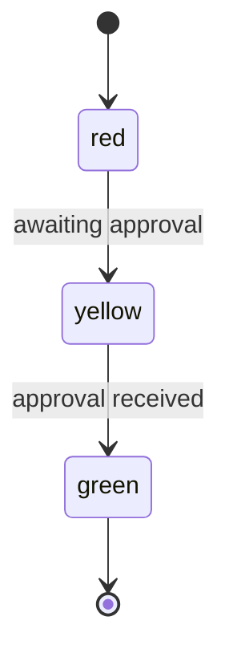

# Reporting state

A node can carry a `state` alongside its `label`: not a debug name, a phase a consumer outside the
graph cares about.
When it changes, the engine emits one event a UI or another service can watch.

## You will learn

- The difference between `label` and `state`
- How to tag a node with `state` in its options
- When the engine emits `stateChange`, and why not on every step
- How to watch `stateChange` from a consumer

## Label names a node, state names a phase

`label` answers "which node produced this," for a trace or a log line. `state` answers "what phase
is the pipeline in," for a consumer that has never seen the graph's shape and doesn't need to.
Several nodes can share one `state`; each keeps its own `label`.

```ts source=docs/examples/reporting-state/traffic-light.ts#nodes
  const request = flow.step(
    outputs(() => "requested"),
    { label: "request", state: "red" },
  );
  const wait = flow.waitFor(userInput("approval"), { label: "await-approval", state: "yellow" });
  const done = flow.step(
    outputs(() => "done"),
    { label: "mark-done", state: "green" },
  );
```

Three different node kinds above each carry their own `state`: "red" while a request is pending,
"yellow" while it waits for approval, "green" once it's done. `state` isn't a `step`-only option:
`waitFor`, `use`, `interrupt`, and `forEach` all take the same `NodeOptions`.

## The engine emits on change, not on entry

You might expect `stateChange` to fire every time a `state`-tagged node runs, the same way `output`
fires on every step.
But a loop that revisits a "red" node several times would then emit several identical events, and a
consumer would have to filter its own noise back out.
The engine tracks the last `state` emitted per thread and fires only when the new value differs:

```ts source=docs/examples/reporting-state/traffic-light.ts#graph
export const trafficLight: Graph = defineGraph("traffic-light", (flow) => {
  const request = flow.step(
    outputs(() => "requested"),
    { label: "request", state: "red" },
  );
  const wait = flow.waitFor(userInput("approval"), { label: "await-approval", state: "yellow" });
  const done = flow.step(
    outputs(() => "done"),
    { label: "mark-done", state: "green" },
  );

  flow.entry(request);
  request.then(wait);
  wait.then(done);
  done.then(flow.finish);
});
```



Running this graph to completion emits exactly three `stateChange` events: into "red" (no `from`,
since nothing came before it), "red" to "yellow", then "yellow" to "green".

> [!NOTE] `state` is optional.
> A node with no `state` never touches the last-emitted value, so a plain bookkeeping step in
> between two state-tagged nodes doesn't reset or interrupt an in-progress phase.

## Watching state from outside the graph

A consumer never inspects the graph to do this, it reads the same event stream every consumer reads:

```ts source=docs/examples/reporting-state/watch-state.ts#watch
export async function collectStateChanges(
  store: SessionStore,
  count: number,
): Promise<Event["stateChange"][]> {
  const changes: Event["stateChange"][] = [];
  for await (const envelope of store.changes()) {
    if (envelope.form !== "committed" || envelope.type !== "stateChange") continue;
    changes.push(envelope.event as Event["stateChange"]);
    if (changes.length >= count) return changes;
  }
  return changes;
}
```

`to` is enough to know the current phase, since it's a fold over the ordered log: the next event's
`from` is always the previous event's `to`. `from` is there for a consumer that only sees one event
at a time, out of context, and wants to show "red → yellow" without replaying the log first.

## Recap

- `label` is for a trace; `state` is for a consumer outside the graph
- Many nodes, of any kind, can share one `state`; each keeps its own `label`
- `stateChange` fires only when the value actually changes, not on every node that carries it
- A consumer reads `to` for the current phase, `from` only if it needs the prior one without
  replaying history
- Next: describe the messages, personas, and tools these steps actually call, in
  [Messages and content](../describing-a-flow/messages-and-content.md)

---

**Reference:** reference.md § defineGraph (`NodeOptions`), § Event (`stateChange`). **Examples:**
`docs/examples/reporting-state/traffic-light.ts`, regions: `nodes`, `graph`;
`docs/examples/reporting-state/watch-state.ts`, region: `watch`. **Section:**
[Building the graph](./README.md) **Prev / Next:**
[Waiting and interrupts](./waiting-and-interrupts.md) /
[Messages and content](../describing-a-flow/messages-and-content.md)
