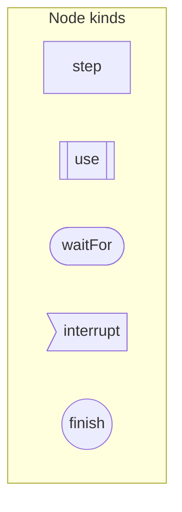
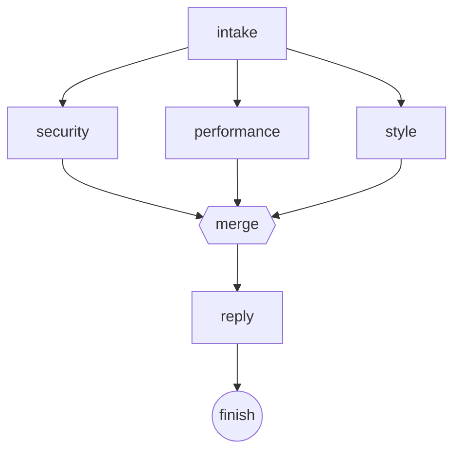

# Wiring a graph

`defineGraph` composes steps into a runnable flow: nodes for work, edges for control flow.

## You will learn

- How to pick the right node kind: `step`, `use`, `waitFor`, `interrupt`, `finish`
- How to route a node's output with `when`, `otherwise`, and `then`
- How `then` with an array fans out, each target on its own forked thread
- How a join is recognized structurally and must use the `join()` builder
- How an edge back to an earlier node forms a loop

## Nodes

A graph has five kinds of node. `step` runs one effect and returns an `Emit`, everything
[Steps and emits](./steps-and-emits.md) covered. `use` composes another graph as a single node,
running on the reaching edge's thread by default. `waitFor` parks until a `Waitable` resolves;
`interrupt` sits alongside it, always armed, ready to win the race first. `finish` is the terminal:
whatever value reaches it is the flow's result.



[Waiting and interrupts](./waiting-and-interrupts.md) covers `waitFor`/`interrupt` in full; this
page only wires plain `step`s.

## Edges

Three edge kinds route a node's output: `when` (route on a condition), `otherwise` (fallthrough),
and `then` (continue, unconditionally). [Thinking in behalf](../get-started/thinking-in-behalf.md)
already used `when`/`otherwise` to route an escalated ticket one of two ways; this page's example
only needs the plain form, since its steps run in a fixed sequence rather than branching:

```ts source=docs/examples/wiring-a-graph/audit.ts#edges
  merge.then(reply);
  reply.then(flow.finish);
```

Edges are forward-only: a `Handle` only ever names nodes that already exist by the time you wire it,
in the order you declare them.
The `security`/`performance`/`style` steps below are each a named `Profile`, a persona, formally
introduced next in [Describing a flow](../describing-a-flow/profiles-and-models.md); treat each one
as an opaque reviewer for now.

## Fanning out

`then` given an array fans out: each target gets its own forked thread, and nothing comes back from
the call itself.
Below, one `intake` step hands the same input to three reviewers at once:

```ts source=docs/examples/wiring-a-graph/audit.ts#fan-out
  intake.then([security, performance, style]);
```

Each of `security`, `performance`, and `style` now runs independently, on its own forked thread, so
one reviewer's context never leaks into another's. [Threads and forking](./threads-and-forking.md)
covers what a forked thread actually shares with its parent.

## Joining

A branch reaches its join the same way any node reaches its next step: an ordinary `.then()` call.
What makes a join different is the node it converges on:

```ts source=docs/examples/wiring-a-graph/audit.ts#join
  const merge = flow.step(
    join((context) => context.inputs),
    { label: "merge" },
  );
  security.then(merge);
  performance.then(merge);
  style.then(merge);
```

You might expect any step reached by three converging edges to just work, since nothing about
`flow.step()` mentions how many edges lead into it.
But the engine needs to tell "one branch reached me" apart from "every branch reached me, run me
once" before it can safely run `merge`, so a node that converges a fan-out's branches must be built
with `join()`, not a plain `flow.step()`.
Building it as a plain step is rejected at boot: the reverse (a `join()`-tagged node reached as an
ordinary single-input step) is rejected too, since neither shape it describes matches how the graph
actually wires it.

`context.inputs` inside a join has one entry per branch, in the order each branch was declared, not
just the one entry a single-input step gets.

Put together, `intake`'s fan-out and the three reviewers converging on `merge` give the whole graph
this shape:



```ts source=docs/examples/wiring-a-graph/audit.ts#graph
  flow.entry(intake);

  intake.then([security, performance, style]);

  const merge = flow.step(
    join((context) => context.inputs),
    { label: "merge" },
  );
  security.then(merge);
  performance.then(merge);
  style.then(merge);

  merge.then(reply);
  reply.then(flow.finish);
```

This diagram is generated from the real `audit` `Graph` object, not hand-drawn, so it can't drift
from the wiring below it: `tools/graph-to-mermaid.ts` renders it, and a test asserts the two stay
byte-identical.

This audit is deliberately small, just enough to show the wiring.
[Fan-out and joining](../agents-in-practice/fan-out-and-joining.md) builds its own, larger version
of the same shape later, to explain why each piece works the way it does.

## Loops

Edges may form cycles: an edge back to an earlier node re-enables it as a new run, and that run's
output supersedes whatever the node produced last time.
This is the entire mechanism a loop needs.
No separate "loop" construct exists, because a graph never distinguishes "an edge I haven't followed
yet" from "an edge back to a node I've already run."

An agent loop is the smallest example: a step that routes back to itself on one condition, and out
to the next node on another. [The agent loop](../agents-in-practice/the-agent-loop.md) builds
exactly that shape, then wraps it into `agentTurn`, the loop every persona in this codebase actually
runs.

> [!NOTE] `invalidate` is the separate, out-of-band path for rerunning a node the current edge
> doesn't lead back to: an interrupt reaching sideways into the graph, say.
> A cycle in the edges themselves is a graph author's ordinary choice; `invalidate` is the runtime's
> escape hatch when no edge already goes there.

## Recap

- Five node kinds: `step` (an effect), `use` (a subgraph), `waitFor`/`interrupt` (park for a
  `Waitable`), `finish` (the terminal)
- Three edge kinds: `when` (route on a condition), `otherwise` (fallthrough), `then` (continue)
- `then` given an array fans out: each target on its own forked thread, nothing returned
- A join's convergence node must be built with `join()`, not a plain `flow.step()`, so the engine
  can validate the wiring
- An edge back to an earlier node is how a loop works, no separate construct needed
- Next: what a forked thread actually carries from its parent, in
  [Threads and forking](./threads-and-forking.md)

---

**Reference:** reference.md § The graph and why, § defineGraph (full block, including the audit
fan-out/join example). **Examples:** `docs/examples/wiring-a-graph/audit.ts`, regions: `edges`,
`fan-out`, `join`, `graph`. **Section:** [Building the graph](./README.md) **Prev / Next:**
[Steps and emits](./steps-and-emits.md) / [Threads and forking](./threads-and-forking.md)
