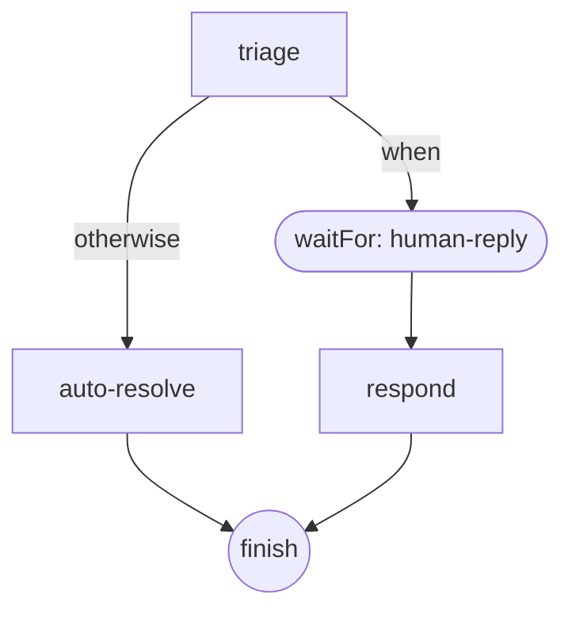

# Thinking in behalf

The tutorial: design one small flow from scratch, a support-ticket triage agent, using the same
five-step methodology "Thinking in React" uses for UI.

## You will learn

- How to identify the turns and personas a problem needs
- How to sketch a graph's shape before writing any wiring code
- How to choose `same`/`fork`/`new` threading per edge
- How to add a wait point for human input
- How to add error handling last, once the happy path works

## Step 1: Identify the turns

A support ticket needs one decision: can this be answered directly, or does it need a person?
That's one turn, one persona: read the ticket, classify it.

Everything downstream branches on that one decision.
Naming it first, before any code, keeps the graph from growing a second reason to exist: one
classification step, one job.

## Step 2: Sketch the shape

Draw the branches before wiring them.
A ticket that resolves on its own finishes immediately; a ticket that needs a person waits for their
reply, then answers using it.

<table>
<tr>
<td>

```ts source=docs/examples/thinking-in-behalf/triage.ts#shape
export const triage: Graph = defineGraph("triage", (flow) => {
  const classify = flow.step(
    async (context) => {
      await context.modelCall(triagePersona);
      const decision = lastAssistantText(context).includes("ESCALATE") ? "escalate" : "resolve";
      return context.output({ decision });
    },
    { label: "triage" },
  );

  const autoResolve = flow.step(
    outputs(() => ({ reply: "Resolved automatically." })),
    { label: "auto-resolve" },
  );

  // #region wait-point
  const waitForHuman = flow.waitFor(userInput("human-reply"));
  // #endregion wait-point

  const respond = flow.step(
    outputs((context) => {
      const reply = context.thread.messages.at(-1) as UserMessage;
      const text = reply.content.find((block) => block.type === "text");
      return { reply: `Escalated with a human reply: ${text?.type === "text" ? text.text : ""}` };
    }),
    { label: "respond" },
  );

  flow.entry(classify);
  classify
    .when((output) => (output as { decision: string }).decision === "escalate", waitForHuman)
    .otherwise(autoResolve);
```

</td>
<td>



</td>
</tr>
</table>

Three steps, one branch, one wait point. `classify` decides which edge fires; `auto-resolve` and
`respond` both end at the same `finish`, since the caller only cares about the final reply, not
which path produced it.

## Step 3: Choose threading

Every edge carries a `ThreadAction`: `same` (default, context keeps growing), `fork` (a new id that
still shares history up to the split), or `new` (a blank thread, fresh history).
See [Threads and forking](../building-the-graph/threads-and-forking.md) for the full contract.

This flow only needs `same`: the human answering an escalated ticket needs the whole ticket in front
of them, not a reset conversation.

```ts source=docs/examples/thinking-in-behalf/triage.ts#threading
  waitForHuman.then(respond, { threadAction: "same" });
```

`same` is also the default, so writing it here is optional.
It's spelled out because choosing it deliberately, and saying why, is the point of this step, not
because the code requires it. `new` earns its place in a different shape: a step that deliberately
starts a clean sub-conversation, unrelated to what came before it.
An unrelated follow-up ticket doesn't need `new` either: a fresh `runFlow()` call already begins on
its own thread.

## Step 4: Add a wait point

`waitFor(userInput(kind))` parks the graph until a message of that kind arrives.
It's what makes `classify`'s escalate branch a real pause, not a dead end.

```ts source=docs/examples/thinking-in-behalf/triage.ts#wait-point
  const waitForHuman = flow.waitFor(userInput("human-reply"));
```

The `kind` string is a label you choose, not an API name: whoever eventually replies (a support
tool, a Slack integration, a person typing into a CLI) sends a message tagged `"human-reply"`, and
this node is the only thing listening for exactly that tag.

## Step 5: Add error handling

Error handling goes last, once the happy path works, not before.
Retrying a step that isn't right yet just retries the wrong behavior faster.

```ts source=docs/examples/thinking-in-behalf/triage.ts#error-handling
export const triageErrorHandlers: ErrorHandler[] = [
  (error, context) => {
    // A malformed classification is never worth retrying: fail fast instead
    // of spending the default handler's retry budget on the same bad reply.
    if (error.type === "validation" && context.attempts === 0) return { action: "fail" };
    return undefined; // defer to runtime()'s built-in default for everything else
  },
];
```

An `ErrorHandler` returns `undefined` to defer to the next one in line; `runtime()` always appends a
default retry-with-backoff handler after whatever list you pass, so returning `undefined` here means
"let the default decide," not "nothing happens." See
[Handling errors](../agents-in-practice/handling-errors.md) for the full decision contract.

## Recap

- Name the turn and its persona before writing any graph code
- Sketch the shape (branches, wait points) before wiring edges
- Choose `same`/`fork`/`new` per edge, and say why, even when the choice is the default
- A wait point is `waitFor(userInput(kind))`; the `kind` is a label you invent, not an API name
- Error handling is the last step, layered onto a working happy path, not built in from the start

Next: the primitives this methodology assembles, `Step`, the four `Emit`s, and how a graph's wiring
actually works.

---

**Reference:** [reference.md § The graph and why](../../reference.md),
[§ Threads](../../reference.md), [§ ErrorHandler](../../reference.md). **Examples:**
`docs/examples/thinking-in-behalf/triage.ts`, regions `shape`, `wait-point`, `threading`,
`error-handling`; built incrementally, one region per step above. **Section:**
[Get started](./README.md) **Prev / Next:** [Quick start](./quick-start.md) /
[Steps and emits](../building-the-graph/steps-and-emits.md)
