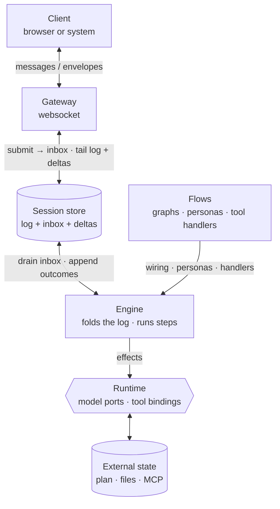
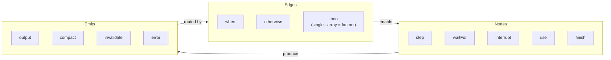
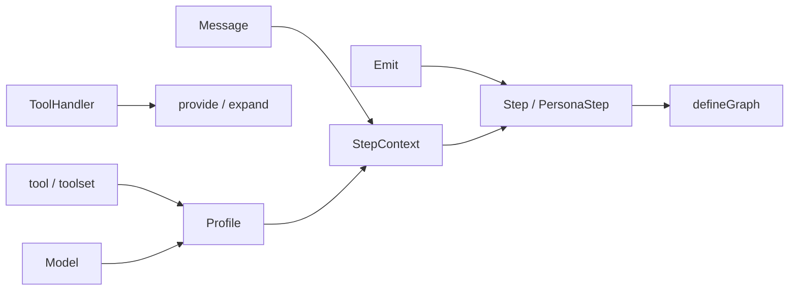
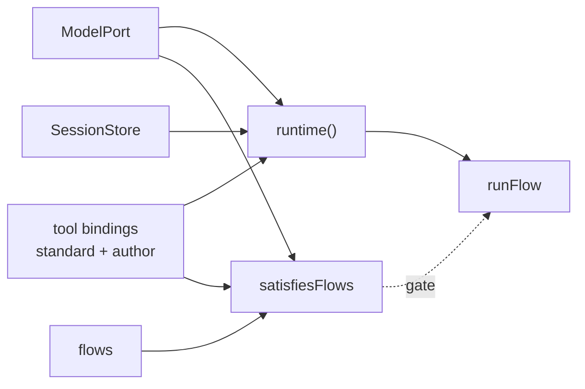
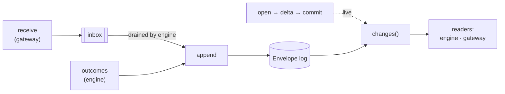
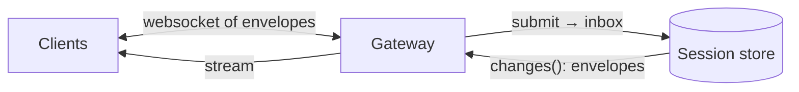

# Architecture

A session is one append-only event log plus an inbox. Clients submit messages
into the inbox through the gateway; the engine drains the inbox, runs steps, and
appends outcomes to the log; state is the fold of the log. The store also carries
live deltas next to the log — streamed, then committed. Flow authors write the
graph and the tool handlers; the running system supplies model ports, storage,
and a few standard tools.



- **The log is committed history; the inbox is pending input.** A message waits in
  the inbox until a step consumes it, then it becomes a log event.
- **Deltas live in the store, not the log.** Partial content streams live and is
  dropped; only the finished event is committed.
- **Clients only touch the gateway**, so many clients share one session.

## The graph, and why

Behaviour is modelled as a directed graph of steps rather than imperative code, so
it is inspectable, resumable, and composable. A **node** is a unit of work, an
**edge** is control flow between nodes, and an **emit** is the single outcome a
node produces. One shape then covers every case — a linear pipeline, an agent
loop, a parallel fan-out, a human gate, and recovery — and because state is a fold
of the log, the same graph replays deterministically and recovers from a crash.



- **Nodes**: `step` (one effect), `waitFor` (park for a `Waitable`), `interrupt`
  (always-armed handler), `use` (a subgraph), `finish` (the terminal — its incoming
  value is the flow's result).
- **Edges** (forward only): `when` (route on output), `otherwise` (fallthrough),
  `then` (continue; an array fans out, each target on its own thread; a
  `threadAction` picks the thread). There is no separate join edge — a join
  node is recognized structurally, as the point where converging edges from a
  fan-out's branches meet, and must be built with the `join()` step builder
  (mirrors `PersonaStep`/`outputs()`) so the engine can validate the wiring.
- **Emits**: `output` (routed by edges), `compact` (rewrite the thread), `invalidate`
  (rerun a node), and `error` (hand to the runner). Only `output` is routed by edges.

## Terms

Two words recur throughout — in the agent loop, in compaction, in the ports — so
they are fixed here.

- **Response** — one model call and the tools it invokes: the model replies, its
  tools run, and that produces one `AssistantMessage` (plus its tool results) on the
  log — one `modelCall`. There is no separate `Reply` type — a response *is* an
  `AssistantMessage`.
- **Turn** — one user message (or a finished compaction) through the responses that
  follow, looping until a response needs no tools. A turn is one thread, one
  persona, one provider. `waitFor` parks between turns; steering folds into the
  current turn; finishing a compaction begins a new turn.

---

# Flow authors

People (or codegen) who define what the system does: the messages and personas,
the tools and their handlers, the steps, and the graph that wires them.



## Interfaces

### Message

A role plus an array of content blocks, following the providers' shape. Text and
images are blocks; a tool call and its result share a `correlationId`. A user
message carries an `intent` (the `standard`/`steering`/`abort` control) and an
optional `kind` — the routing label that `waitFor` and `interrupt` match on
(`"follow-up"`, `"story-decision"`). A standard message and a follow-up are the
same message; only the timing differs.

```ts
type ContentBlock =
  | { type: "text"; text: string }
  | {
      type: "thinking";
      text: string; // the visible summary; empty when the provider returns encrypted-only
      signature?: string; // one opaque round-trip token: Anthropic signature, OR the OpenAI reasoning item id / encrypted content
      redacted?: boolean; // a safety-redacted block; its opaque payload lives in `signature`
    }
  | { type: "image"; mediaType: string; data: string }
  | { type: "toolCall"; correlationId: string; name: string; input: unknown }
  | { type: "toolResult"; correlationId: string; output: unknown; isError?: boolean };

type Intent = "standard" | "steering" | "abort";

type Message =
  | { role: "system"; content: ContentBlock[] }
  | { role: "user"; content: ContentBlock[]; intent: Intent; kind?: MessageKind }
  | { role: "assistant"; content: ContentBlock[]; provider: string; model: string; usage: Usage }
  | { role: "tool"; content: ContentBlock[] };

type UserMessage = Extract<Message, { role: "user" }>;

type Usage = {
  input: number;
  output: number; // includes reasoning tokens
  reasoning?: number; // thinking/reasoning tokens (Anthropic thinking_tokens · OpenAI reasoning_tokens)
  cacheRead?: number;
  cacheWrite?: number;
  cost?: number; // 0 for free/local, absent when unknown
};
```

```ts
const question: Message = {
  role: "user",
  intent: "standard",
  content: [{ type: "text", text: "Plan the checkout rewrite." }],
};
```

`thinking` blocks are persisted on the assistant message and passed back unchanged
on the next call — so a turn can be inspected later, and because the providers
require it for reasoning continuity during tool use. The opaque round-trip token
lives in one field, `signature`: Anthropic's block signature (the full thinking is
encrypted there, so `text` may be empty), or OpenAI's reasoning item id / encrypted
content (only a summary is visible as `text`). A `ModelPort` keeps a block with its
`signature` when replaying to the same provider, and converts it to plain text when
the thread crosses to a different provider. Crucially the port sends thinking blocks
back **unmodified** — mutating one breaks its signature and the API rejects the
message. Retention is the provider's decision, not the port's: within a tool-use
loop the blocks are kept (required for continuity), and across turns the API keeps
or strips them by model class (kept on Opus 4.5+/Sonnet 4.6+, stripped on older).
The port never strips them itself; the block also stays on the thread for inspection.

### Model

A structured descriptor: identity, context window, the reasoning levels it
supports, and its price. The engine validates a persona's reasoning against this
and derives cost from the price.

```ts
type ReasoningLevel = "off" | "minimal" | "low" | "medium" | "high" | "xhigh";

type Model = {
  identifier: string;
  provider: string;
  contextWindow: number;
  reasoning: ReasoningLevel[]; // supported levels; [] = none
  price?: { input: number; output: number; cacheRead?: number; cacheWrite?: number };
};
```

```ts
const qwen14b: Model = {
  identifier: "qwen-14b",
  provider: "ollama",
  contextWindow: 128_000,
  reasoning: ["off", "low", "medium"],
};
```

### tool / toolset

A `tool` is one typed capability; a `toolset` is a group produced together (MCP or
a curated bundle) whose members appear when expanded.

```ts
function tool<Input, Output>(name: string, describe: string): Tool<Input, Output>;
function toolset(name: string, describe: string): Toolset;
```

```ts
const search = tool<{ query: string }, { hits: string[] }>("search", "Search the web.");
const mcp = toolset("mcp", "Whatever the connected servers expose.");
```

### ToolHandler

The implementation behind a tool, written by the author. It takes the input and a
context that can stream progress and launch a child flow. It may re-run on resume,
so it owns its idempotency.

```ts
type ToolContext = {
  thread: ThreadId;
  openStream(type: EventType): Stream; // open a fresh, logged stream scoped to this thread
  runFlow: (flow: Graph, initialPrompt: Message) => Promise<unknown>;
};

type ToolHandler<Input = unknown, Output = unknown> = (
  input: Input,
  context: ToolContext,
) => Promise<Output>;
```

```ts
// a handler that spawns a sub-agent — this is how spawning works
const researchHandler: ToolHandler<{ question: string }, unknown> =
  async ({ question }, context) => context.runFlow(researcher, userText(question));
```

### provide / expand

Bind a reference to its implementation. `provide` fills a `tool`; `expand` fills a
`toolset`. Mixing them is a compile error.

```ts
function provide<Input, Output>(tool: Tool<Input, Output>, handler: ToolHandler<Input, Output>): Binding;
function expand(toolset: Toolset, discover: () => Promise<Record<string, ToolHandler>>): Binding;
```

```ts
const mcpBinding = expand(mcp, () => mcpServer.discover());
```

### Profile

A persona: a structured model, a system prompt, the tools it may call, and an
optional reasoning level (which must be one the model supports).

```ts
type Profile = {
  model: Model;
  system: string;
  tools: (Tool | Toolset)[];
  reasoning?: ReasoningLevel; // must be in model.reasoning — checked with coverage
};
```

```ts
const engineer: Profile = {
  model: qwen27b,
  system: prompts.engineer,
  tools: [search, filesystem, mcp],
  reasoning: "high",
};
```

### StepContext

What a step sees and does. `thread.messages` is the assembled view — compaction
applied, older messages trimmed; `thread.history` is the full record on the thread.
`modelCall` makes one model request and runs any tools it returns, appending all of
it to the log, and returns a small `ModelCallResult` the graph can route on.
`openStream(type)` opens a fresh, logged stream scoped to
the step's own thread — deltas broadcast live, then `commit`/`abort` finalizes an
event into the log, same as a model call's own internal stream. A restarted node
needs no special channel: `invalidate`
pushes its `reason` onto the thread, so a rerun agent reads it among its messages.

```ts
interface StepContext {
  readonly thread: {
    id: ThreadId;
    label?: string;
    forkedFrom?: { thread: ThreadId; at: number };
    parentThreadId?: ThreadId;
    messages: Message[]; // the assembled view — compaction applied, tail trimmed
    history: Message[]; // the full record on this thread, including compaction messages
  };
  readonly inputs: unknown[]; // upstream outputs; a join gets one per branch
  openStream(type: EventType): Stream; // open a fresh, logged stream scoped to this thread

  modelCall(profile: Profile): Promise<ModelCallResult>; // one request + its tools, appended to the log
  callTool<Input, Output>(tool: Tool<Input, Output>, input: Input): Promise<Output>;

  output<Result>(value: Result): Emit<Result>;
  compact(replace: (messages: Message[]) => Promise<Message[]>, meta?: unknown): Promise<Emit<Message[]>>;
  invalidate(target: NodeId, options?: { threadAction?: ThreadAction; reason?: Message }): Emit<never>;
  fail(error: StepError): Emit<never>;
}

type ModelCallResult = { usedTools: boolean; usage: Usage };
```

### Step and PersonaStep

A step is a node's body. A step that uses a model is a `PersonaStep` — it carries
its `persona`, so the graph and coverage check see it with no separate
registration.

```ts
type Step<Result = unknown> = (context: StepContext) => Promise<Emit<Result>>;
type PersonaStep<Result = unknown> = Step<Result> & { persona: Profile };
// `Result` is the step's output type (a generic parameter, default `unknown`).
// `context.output(value)` is typed to it, and it flows into `Emit<Result>`. In the
// log an `output` event is heterogeneous, so its value reads back as `unknown`;
// a typed lens keyed by the step handle can narrow it:
//   function outputsOf<Result>(handle: Handle & { _result?: Result }, log: Envelope[]): Result[];
```

```ts
// `modelStep(profile)` builds the persona step the loop repeats: one model request
// with its tools. `context.modelCall` is the same call available inside any step.
const modelStep = (profile: Profile): PersonaStep<ModelCallResult> =>
  Object.assign(
    async (context: StepContext) => context.output(await context.modelCall(profile)),
    { persona: profile },
  );
```

### Emit

The one outcome a step returns, one of four: an `output` (the node's value, what
edges route on), a `compact` (replace the thread's messages — a new turn, same
thread), an `invalidate` (rerun a node), or an `error` (hand off to the runner).

```ts
type Emit<Result> =
  | { output: Result }
  | { compact: Message[]; meta?: unknown }
  | { invalidate: NodeId; threadAction: ThreadAction; reason?: Message }
  | { error: StepError };

type StepError = {
  type: string; // category: "provider" | "tool" | "timeout" | "validation" | …
  message: string;
  retryable?: boolean; // advisory hint from the raiser (e.g. a 429)
  cause?: unknown; // the raw error, for logs
};
```

### Threads

A thread is one growing message context, identified by a UUID and an optional
`label`. Every place that starts work — an edge, an `invalidate` — chooses a
`threadAction`, so the vocabulary is the same everywhere.

```ts
type ThreadAction = "same" | "fork" | "new";
```

- **`same`** (default) — continue this thread; context grows.
- **`fork`** — a new id that shares this thread's history up to the split point,
  linked back by `forkedFrom: { thread, at }`. A tree on an existing thread —
  distinct from `parentThreadId`, which is ownership (a spawned sub-agent).
- **`new`** — a brand-new empty thread with a fresh initial message; a deliberate
  reset, such as a new turn that drops prior context.

Forking from an earlier `at` is how you revert and branch: split at that point
onto a new id and the tail is left behind. `flow.step(run, { label: "coder" })`
gives a thread a stable label you can address.

### Waitable

What a `waitFor`/`interrupt` node parks on. `provider` names which kind of
thing can satisfy it (checked at boot by `satisfiesFlows` against registered
`WaitableSource`s); `label` is a human-readable identity for logs/debugging;
`match` is a pure function over the committed session log — no IO of its own.
`userInput` is the one built-in `Waitable`: it parks until a message of the
given `kind` arrives, so `waitFor(userInput(kind))` behaves exactly like the
bare-`kind` form did before `Waitable` existed.

```ts
interface Waitable<T> {
  readonly provider: string;
  readonly label: string;
  match(events: readonly Envelope[]): T | undefined;
}

function userInput(kind: MessageKind): Waitable<UserMessage>;
```

### defineGraph

Composes steps into a runnable flow. Nodes: `step`, `use`, `waitFor`, `interrupt`,
`finish`; `entry` is a `Flow` method that marks the start node, not a node kind.
Edges: `when`, `otherwise`, `then` (single, or an array that fans out —
each target on its own thread; there is no separate `Group` return type).

```ts
function defineGraph(name: string, build: (flow: Flow) => void): Graph;

interface Flow {
  step<Result>(run: Step<Result>, options?: { label?: string }): Handle;
  use(subgraph: Graph): Handle; // compose a graph as a node; runs on the reaching edge's thread (default same)
  waitFor<T>(waitable: Waitable<T>): Handle; // park until `waitable`'s condition is met
  interrupt<T>(waitable: Waitable<T>, run: Step): Handle; // always armed
  entry(node: Handle): void;
  readonly finish: Handle; // route a value in to end the flow; that value is the result
}

type EdgeOptions = { threadAction?: ThreadAction; prompt?: (output: unknown) => Message }; // threadAction omitted = "same"

interface Handle {
  readonly id: NodeId; // the node this handle addresses — target for `invalidate`
  when(condition: (output: any) => boolean, to: Handle, options?: EdgeOptions): Handle; // returns this handle (the source), for chaining more `when`/`otherwise`
  otherwise(to: Handle, options?: EdgeOptions): Handle; // returns this handle (the source), same reason
  then(to: Handle, options?: EdgeOptions): void; // continue to one node
  then(to: Handle[], options?: EdgeOptions): void; // fan out — each target on its own forked thread
}
```

Behaviour: a node runs when its trigger is met and it has no current output. An
agent loops within a thread through a self `then`. `then` with an array fans
out, each target on its own forked thread — no special return value comes
back. A branch reaches its join the same way any node reaches its next step:
ordinary `.then()` calls on whatever handle its own chain ends at. The
convergence node — reached by edges converging from every branch of one
fan-out — must be built with the `join()` step builder (see `JoinStep`/`join()`
in src/flow/step.ts), so the engine can validate the wiring structurally: a
node reached by converging fan-out edges without `join()` tagging is rejected,
and a `join()`-tagged node reached as a plain single-input step is rejected too.
`waitFor` parks until its `Waitable` resolves — for the built-in `userInput`,
a matching message, then applies it to the thread. `interrupt` fires wherever the
graph currently is: while a `waitFor` node is parked on a message-based `Waitable`,
every armed `interrupt` races it too, whichever provider it's built on — a
message-based interrupt is resolved by kind, a signal-based one by its own
`match()` against the committed log — and whichever condition is satisfied first
wins; the loser keeps waiting. `runFlow`'s blocking driver runs this race for real
(`waitForRace` in `src/engine/runtime/execution.ts`); `tick()`'s non-blocking
equivalent still only checks message-based interrupts each call (see § tick()).
result, which is also the output of a `use` node and what `runFlow` resolves with.
A `use` node seeds its subgraph with the incoming value as its initial prompt.
Edges may form cycles: an edge back to an earlier node re-enables it as a new run,
whose output supersedes the old — this is how a loop works. `invalidate` is the
separate, out-of-band path, for when an interrupt or a step reruns a node the flow
does not lead back to.

A node reads input two ways: `context.inputs[0]` is the exact value the previous node
produced (any type; one entry per branch at a join), and `context.thread.messages` is
the conversation on its thread. They are independent — the thread is filled by
`modelCall`, the inbox, and compaction, not by a step's `output`. A step that needs
the model's words reads the thread; one that needs the previous result reads `inputs`.

```ts
// Reading input two ways.
export const twoWays = defineGraph("two-ways", (flow) => {
  // (a) reads the THREAD via `modelCall` (the reply lands on the log), then parses
  //     the last message into a typed output
  const classify = flow.step(async (context) => {
    await context.modelCall(classifier);
    return context.output(readLabel(context.thread.messages));
  });

  // (b) reads the PREVIOUS OUTPUT — the label, not the conversation
  const route = flow.step(async (context) => {
    const label = context.inputs[0] as "bug" | "feature";
    return context.output(label === "bug" ? triagePlan : featurePlan);
  });

  flow.entry(classify);
  classify.then(route);
  route.then(flow.finish);
});
```

## Full examples

```ts
// 1 · The agent loop, and an interactive chat built from the same shape.
// `agentTurn` repeats one `modelCall` until a response uses no tools, then routes to
// `finish`. Each `modelCall` output is a `ModelCallResult` the edges test.
const agentTurn = (persona: Profile) =>
  defineGraph(persona.system, (flow) => {
    const respond = flow.step(modelStep(persona));
    const compact = flow.step(compactWith(persona));
    flow.entry(respond);
    respond
      .when((result) => !result.usedTools, flow.finish) // no tools → the turn is done
      .when((result) => overBudget(result.usage, persona.model), compact) // budget → compact
      .otherwise(respond); // tools ran → keep going
    compact.then(respond); // a new turn on the same thread, lighter
  });

// The interactive chat is just that turn, looped: run a turn, wait for the next
// prompt, run again — all on the same thread (the default), so context carries
// across turns. Steering arriving mid-turn is folded in by the runtime.
export const chat = defineGraph("chat", (flow) => {
  const loop = flow.use(agentTurn(assistant));
  const waitForPrompt = flow.waitFor(userInput("follow-up"));
  flow.entry(loop);
  loop.then(waitForPrompt); // turn finished → wait for the next prompt
  waitForPrompt.then(loop); // new prompt → run another turn, same thread
});
```

```ts
// 2 · A big fork over one prompt, joined into a single reply. Each check is a
// persona on its own forked thread; each branch reaches `merge` by an ordinary
// `.then()` edge. The join runs once with all three results and produces the
// reply, routed to `finish`.
export const audit = defineGraph("audit", (flow) => {
  const intake = flow.step(readPrompt);
  const security = flow.step(modelStep(securityReviewer));
  const performance = flow.step(modelStep(performanceReviewer));
  const style = flow.step(modelStep(styleReviewer));
  const merge = flow.step(join((context) => context.inputs)); // the join target — runs once, one input per branch
  const reply = flow.step(modelStep(lead)); // reads the merged reviews from context.inputs[0]

  flow.entry(intake);
  intake.then([security, performance, style]); // fan out — each on its own forked thread
  security.then(merge); // each branch reaches the join by an ordinary edge
  performance.then(merge);
  style.then(merge);
  merge.then(reply);
  reply.then(flow.finish);
});
```
```

```ts
// 3 · A composed pipeline of agent loops with world-state steps between them.
// Each phase is `use(agentTurn(persona))`; the plain steps in between read the
// previous result and the external world, and build the next phase's prompt.
export const feature = defineGraph("feature", (flow) => {
  const ask = flow.use(agentTurn(questioner)); // asks until no ambiguities, then finishes
  const gatherContext = flow.step(readWorldStateAsPrompt); // world state → prompt for plan
  const plan = flow.use(agentTurn(planner));
  const fetchPlan = flow.step(readPlanAsPrompt); // plan store → prompt for implement
  const implement = flow.use(agentTurn(implementor));
  const summarise = flow.step(readImplementationSummary); // → prompt for review
  const review = flow.use(agentTurn(reviewer)); // reads plan + summary + the code changes itself

  flow.entry(ask);
  ask.then(gatherContext);
  gatherContext.then(plan, { threadAction: "new" });
  plan.then(fetchPlan);
  fetchPlan.then(implement, { threadAction: "new" });
  implement.then(summarise);
  summarise.then(review, { threadAction: "new" });
  review
    .when((result) => result.approved, flow.finish)
    .otherwise(implement, { threadAction: "fork" }); // not done → rerun implementor,
  //   forked (keeping its work) and seeded with the review as its prompt
});
```

---

# Systems running flows

The runtime that turns authored flows into running sessions: a deployment, a
server, or a test harness. It supplies model ports, storage, and tool bindings,
checks coverage, and runs flows.



## Interfaces

### ModelPort

The adapter for one model. It only responds — compaction is a normal response with
a summary prompt. It expands the persona's tool palette, and passes thinking blocks
back **unmodified** (mutating one breaks its signature) — the provider decides
cross-turn retention, so the port never strips them. Its only reshaping is
cross-provider: a thread that switched models converts the prior provider's thinking
to text. It derives cost from the price.

```ts
interface ModelPort {
  readonly model: Model;
  respond(profile: Profile, messages: Message[], stream: DeltaSink): Promise<AssistantMessage>;
}
```

```ts
const fakePort: ModelPort = {
  model: qwen14b,
  respond: async () => ({
    role: "assistant",
    provider: "ollama",
    model: "qwen-14b",
    content: [{ type: "text", text: "ok" }],
    usage: { input: 1, output: 1, cost: 0 },
  }),
};
```

Two real adapters, mapping each provider's thinking onto the one `thinking` block
(sketches). The persona's `reasoning` level becomes the provider's effort control,
and prior `thinking` blocks are sent back unmodified — the API strips or keeps them
by model class.

```ts
// Anthropic — Claude Opus 4.8: adaptive thinking tuned by `effort`; the full
// thinking is encrypted in each block's `signature`, which must round-trip.
const opus48: ModelPort = {
  model: opus48Model,
  respond: async (profile, messages, stream) => {
    const response = await anthropic.messages.create({
      model: "claude-opus-4-8",
      max_tokens: 32_000,
      effort: profile.reasoning ?? "medium", // adaptive thinking, tuned by effort
      thinking: { display: "summarized" }, // return a visible summary (default is omitted)
      system: profile.system,
      messages: toAnthropic(messages), // thinking blocks passed back unmodified, with signature
      tools: paletteFor(profile),
    }, stream);
    // content: thinking { thinking, signature } (+ redacted_thinking) · text · tool_use
    return {
      role: "assistant",
      provider: "anthropic",
      model: "claude-opus-4-8",
      content: response.content.map(fromAnthropicBlock), // thinking → { type:"thinking", text, signature }
      usage: {
        input: response.usage.input_tokens,
        output: response.usage.output_tokens,
        reasoning: response.usage.output_tokens_details?.thinking_tokens,
      },
    };
  },
};

// OpenAI — GPT-5.5 (Responses API): `reasoning.effort` (defaults to medium); raw
// reasoning hidden, a `summary` is visible, `encrypted_content` round-trips.
const gpt55: ModelPort = {
  model: gpt55Model,
  respond: async (profile, messages, stream) => {
    const response = await openai.responses.create({
      model: "gpt-5.5",
      reasoning: { effort: profile.reasoning ?? "medium", summary: "auto" },
      include: ["reasoning.encrypted_content"], // get the encrypted reasoning to send back
      input: toResponses(messages), // reasoning items passed back unmodified
      tools: paletteFor(profile),
    }, stream);
    // output: reasoning { summary, encrypted_content } · message · function_call
    return {
      role: "assistant",
      provider: "openai",
      model: "gpt-5.5",
      content: response.output.map(fromResponsesItem), // reasoning → { type:"thinking", text: summary, signature: encrypted_content }
      usage: {
        input: response.usage.input_tokens,
        output: response.usage.output_tokens,
        reasoning: response.usage.output_tokens_details?.reasoning_tokens,
      },
    };
  },
};
```

### Tool bindings

The tool implementations a runtime offers — the standard library plus the author's
own, concatenated into one list.

```ts
import { read, write, edit, bash, standardBindings } from "engine/std/tools";

const bindings = [...standardBindings, ...authorBindings];
```

### satisfiesPersonas / satisfiesFlows

The coverage check. Given the model resolver and the tool bindings, it returns
everything the personas need that is not provided: a missing model port, a missing
tool, or an unsupported reasoning level. `satisfiesFlows` walks each flow's graph
statically — every `step`/`interrupt` node, recursing into `use` subgraphs — to
find every persona in play, then checks it across all of them. It also walks every
`waitFor`/`interrupt` node's `.waitable.provider` the same way, and checks each
distinct provider (other than the built-in `"userInput"`, which is always
satisfied) against the optional `waitableSources` resolver; an unresolved provider
is reported as `{ kind: "waitable", provider }`. Empty means ready.

```ts
type Missing =
  | { kind: "model"; model: string }
  | { kind: "tool"; model: string; tool: string }
  | { kind: "reasoning"; model: string; level: ReasoningLevel }
  | { kind: "waitable"; provider: string };

function satisfiesPersonas(
  personas: Profile[],
  models: (model: Model) => ModelPort | undefined,
  bindings: Binding[],
): Missing[];

function satisfiesFlows(
  flows: Graph[],
  models: (model: Model) => ModelPort | undefined,
  bindings: Binding[],
  waitableSources?: (provider: string) => WaitableSource | undefined,
): Missing[];
```

```ts
const missing = satisfiesFlows([feature, chat], resolveModel, bindings, waitableSources);
if (missing.length) throw new Error(JSON.stringify(missing));
```

### runtime / runFlow

`runtime` builds what a flow runs against — model resolution, bindings, and
store — expanding toolsets once. `runFlow` seeds a new session with a user
message, drives it to completion, and resolves with the terminal output; a
`parentThreadId` makes it a child, which is how a tool spawns a sub-agent. There
is no separate `schedule` or `spawn`.

```ts
async function runtime(config: {
  models: (model: Model) => ModelPort;
  bindings: Binding[];
  store: SessionStore;
  errorHandlers?: ErrorHandler[]; // consulted on a step error; a default retry handler runs last
}): Promise<Runtime>;

function runFlow(
  flow: Graph,
  initialPrompt: Message,
  runtime: Runtime,
  options?: { parentThreadId?: ThreadId },
): Promise<unknown>;
```

```ts
const ready = await runtime({ models: resolveModel, bindings, store });
await runFlow(feature, userText("Add rate limiting to the API."), ready);
```

`tick` advances a flow by one step per independently-progressing cursor and
returns; `tickUntilSuspended` calls `tick` in a loop until every cursor is
parked or done. Both reconstruct where the flow is purely from `runtime.store`
— no position survives in a JS closure between calls, so a fresh `Runtime`
(same store) resumes exactly like the original one. A `waitFor` with a
message already waiting is consumed inline, without counting as a step. A
non-message `Waitable` (e.g. signal-based) is checked directly against the
committed log instead, draining and committing at most one pending signal
per call before re-checking — never blocking/polling.
**Internal** — neither is exported from `src/index.ts`; the `behalf/testing`
module (below) wraps them in a test author's vocabulary.

```ts
interface CursorState {
  node: NodeId;
  status: "active" | "parked" | "done";
  waitingFor?: MessageKind[]; // present only when status is "parked" — a non-message Waitable reports its own `label` here, same shape (MessageKind is just `string`)
  result?: unknown; // present only when status is "done" (root cursor only)
  parent?: string; // absent = the root cursor; present = which cursor this folds into (a fan-out branch or a `use` subgraph)
}

type TickOutcome = CursorState[]; // one entry per independently-progressing cursor; a single-cursor flow is always a one-element array

function tick(flow: Graph, runtime: Runtime): Promise<TickOutcome>;
function tickUntilSuspended(flow: Graph, runtime: Runtime): Promise<TickOutcome>;
```

### Errors

A step fails by emitting `{ error }`, or by throwing — the runner wraps a throw as
`{ type: "unexpected", retryable: false }`. Failure is the runner's business, not
the graph's: an `error` is never routed by an edge. A *logical* failure — a review
rejected, tests red — is a normal `output` you route on with `when`; only a
*broken* step is an `error`.

The runner appends an `error` event, then consults the runtime's `errorHandlers` in
order — the first decision wins; none means fail.

```ts
type ErrorContext = {
  step: { id: string; name?: string };
  thread: ThreadId;
  attempts: number; // times this step has already errored
  log: Envelope[]; // the session so far, to inspect
};

type ErrorDecision = { action: "retry"; after?: number } | { action: "fail" };

type ErrorHandler = (error: StepError, context: ErrorContext) => ErrorDecision | undefined;
// undefined → defer to the next handler
```

Behaviour: `retry` re-runs the step after `after` ms and bumps `attempts`; `fail`
halts the flow and `runFlow` rejects. `retryable` is only an advisory hint from the
raiser — the handler owns the policy. A default handler runs last: it retries
`retryable` errors with exponential backoff up to a small cap, otherwise fails.

A handler with this shape (the built-in default uses the same pattern, with its
own small cap and base delay — not necessarily these exact numbers):

```ts
const backoff: ErrorHandler = (error, { attempts }) =>
  error.retryable && attempts < 5
    ? { action: "retry", after: 250 * 2 ** attempts }
    : { action: "fail" };
```

## Full examples

```ts
// 1 · Run a flow end to end in a test, all fakes.
const store = memoryStore();
const ready = await runtime({
  models: () => fakePort,
  bindings: [provide(ask, async () => ({ answer: "42" }))],
  store,
});
await runFlow(chat, userText("hi"), ready);
```

```ts
// 2 · Production wiring with a coverage gate over models and tools.
const bindings = [...standardBindings, ...authorBindings];
const missing = satisfiesFlows([feature, chat], resolveModel, bindings);
if (missing.length) throw new Error("unfilled: " + JSON.stringify(missing));
const ready = await runtime({ models: resolveModel, bindings, store });
```

---

# Testing

A separate entry point, `behalf/testing` — not part of the public API surface
at `src/index.ts` and not covered by the "Systems running flows" section
above. It wraps the engine's internal, cursor-based `tick`/`tickUntilSuspended`
primitives in a test author's own vocabulary, the same way a fake-timer
library wraps a runtime's clock: purpose-built verbs instead of raw internals
(`CursorState`, `parent`, `FanOutGroup`).

## Interfaces

### stepOnce / stepUntilBlocked

Advance a flow one node, or drive it until every lane is parked or done. Each
call returns a `StepResult` — one `StepState` per independently-progressing
lane (a fan-out branch, a `use` subgraph, or the root).

```ts
interface StepState {
  laneId: string; // synthesized per call — stable within one snapshot, not across calls; key off `node` to compare lanes over time
  node: NodeId;
  status: "active" | "parked" | "done";
  // "parked" covers two different situations, distinguished only by whether
  // `waitingFor` is present: blocked on external input (a `waitFor` node with
  // nothing in the inbox that matches — `waitingFor` lists the kinds it's
  // armed for), or structurally parked (a fan-out branch that finished its
  // own chain and is waiting on its siblings to reach the join — no
  // `waitingFor`, nothing to check the inbox for). Check for `waitingFor`,
  // not just the status string, to tell the two apart.
  waitingFor?: MessageKind[];
  result?: unknown; // present only when done
}

type StepResult = StepState[];

function stepOnce(flow: Graph, runtime: Runtime): Promise<StepResult>;
function stepUntilBlocked(flow: Graph, runtime: Runtime): Promise<StepResult>;
```

### stepUntil / atNode / StepUntilError

`stepUntil` calls `stepOnce` in a loop until `condition` is satisfied. It
throws `StepUntilError("stalled")` the moment every lane is `"parked"` or
`"done"` and the condition still isn't met — that state is deterministic, so
stepping again can't help — and `StepUntilError("budget-exceeded")` if
`maxSteps` (default 1000) is spent while lanes are still active. `atNode`
builds a condition satisfied once any lane sits at a given step.

```ts
function stepUntil(
  flow: Graph,
  runtime: Runtime,
  condition: (state: StepResult, runtime: Runtime) => boolean,
  options?: { maxSteps?: number },
): Promise<StepResult>;

function atNode(step: Handle): (state: StepResult) => boolean;

class StepUntilError extends Error {
  readonly reason: "stalled" | "budget-exceeded";
}
```

## Full examples

```ts
// 1 · Drive a flow node by node, asserting on each lane's state.
const ready = await runtime({ models: () => fakePort, bindings, store });
const first = await stepOnce(feature, ready);
expect(first).toEqual([{ laneId: "root#0", node: "ask", status: "active" }]);
```

```ts
// 2 · Run until a fan-out's branches are all parked or done, then assert on
// the concurrent lanes.
const state = await stepUntilBlocked(audit, ready);
expect(state.filter((lane) => lane.status === "parked")).toHaveLength(3);
```

```ts
// 3 · Step until a specific node is reached, or fail loudly if the flow never
// gets there.
await stepUntil(feature, ready, atNode(review));
```

---


# Session store

The durable spine of a session: an append-only log of envelopes, an inbox of
pending input, and live deltas. Clients submit into the inbox; the engine drains
it and appends outcomes; state is the fold of the log.



## Interfaces

### Event

The payload of a durable fact. Each event is a named, typed shape; it carries no
`type` field — the envelope names it. A session begins with a user `message`.
`signal` is a non-conversational fact a `Waitable` can match on — never folded
into `Thread.messages`, unlike `message`; `name` is open like `MessageKind`,
since `Waitable`s are user-extensible and the library can't enumerate every
external fact an app might define.

```ts
type Event = {
  message: { message: Message };
  output: { value: unknown };
  toolCall: { correlationId: string; name: string; input: unknown };
  toolResult: { correlationId: string; output: unknown; isError?: boolean };
  compaction: { messages: Message[]; meta?: unknown };
  invalidation: { target: NodeId; threadAction: ThreadAction; reason?: Message };
  error: { type: string; message: string; retryable?: boolean; cause?: unknown };
  signal: { name: string; payload?: unknown };
};

type EventType = keyof Event;
```

### Envelope

The wrapper around every event on the wire and in the log. `form` says whether it
is committed, in-progress (a streaming snapshot), or a live delta; `type` names the
event; `stepId`/`stepName` associate it with the step that produced it (a UUID and
its name — `stepName` is the same `label` a `flow.step(run, { label })` declares,
omitted when the step has none); `sequence` is the per-session ordinal (for order,
cursors, dedup); `at`
is wall-clock time; `aborted` marks an event cancelled mid-stream — there is no
separate cancellation event.

```ts
type Envelope<Type extends EventType = EventType> =
  | {
      form: "committed" | "in-progress";
      sessionId: SessionId;
      threadId?: ThreadId;
      stepId?: string;
      stepName?: string;
      type: Type;
      event: Event[Type];
      sequence: number;
      at: number;
      aborted?: boolean;
    }
  | {
      form: "delta";
      sessionId: SessionId;
      threadId?: ThreadId;
      stepId?: string;
      correlationId: string;
      at: number;
      delta: Delta;
    };

type Delta =
  | { correlationId: string; open: "text" | "thinking" | "toolCall"; name?: string }
  | { correlationId: string; text: string }
  | { correlationId: string; partialInput: string }
  | { correlationId: string; close: true };
```

### SessionStore

The log, the pending queue, and the delta stream. `receive` adds a pending
entry — a real conversational `message` or a non-conversational `signal` a
`Waitable` can match on — to one shared queue that preserves arrival order
across both kinds; `consume` finds and removes a pending entry in one call —
how the engine drains it at a `waitFor` node (a matched message is folded into
`Thread.messages` and logged as a `message` event; a signal is logged as a
`signal` event and never folded into the thread); `append` commits an event
(the store stamps sequence, time, session); `open` begins a streaming event
that broadcasts deltas and commits (or aborts) at the end; `changes` yields
envelopes of every form.

```ts
type PendingEntry =
  | { kind: "message"; message: UserMessage }
  | { kind: "signal"; name: string; payload?: unknown };

interface SessionStore {
  events(): Envelope[]; // committed envelopes
  inbox(): PendingEntry[]; // pending input, not yet applied
  receive(entry: PendingEntry): void;
  consume(matches: (entry: PendingEntry) => boolean): PendingEntry | undefined; // find-and-remove a pending entry
  append(event: Event[EventType], meta: { type: EventType; stepId?: string; stepName?: string; threadId?: ThreadId }): void;
  open(pending: { correlationId: string; type: EventType; stepId: string; stepName?: string; threadId: ThreadId }): Stream;
  changes(): AsyncIterable<Envelope>;
}

type Stream = {
  delta(part: Delta): void; // broadcast partial content — not persisted
  commit(event: Event[EventType]): void; // finalize into the log
  abort(): void; // commit what streamed, mark the envelope aborted
};
```

type Stream = {
  delta(part: Delta): void; // broadcast partial content — not persisted
  commit(event: Event[EventType]): void; // finalize into the log
  abort(): void; // commit what streamed, mark the envelope aborted
};
```

## Full examples

```ts
// 1 · Tail the log to rebuild state; ignore deltas and in-progress snapshots.
for await (const envelope of store.changes()) {
  if (envelope.form === "committed") render(fold(flow, store.events()));
}
```

```ts
// 2 · Reconnect: replay committed envelopes, then the in-progress snapshot.
for (const envelope of store.events()) socket.send(envelope);
// the store then emits an `in-progress` envelope per streaming event, then deltas
```

```ts
// 3 · The tool trace of one correlation, call → result.
const trace = store
  .events()
  .filter((envelope) => envelope.type === "toolCall" || envelope.type === "toolResult");
```

---

# Gateway

The only thing clients touch. It exposes a websocket that streams the store's
envelopes — committed events, in-progress snapshots, and live deltas — and accepts
messages from the client into the inbox. Many clients, one session.



## Interfaces

### Gateway

`connect` attaches a client's websocket to a session and streams every envelope to
it, starting with the committed log and any in-progress snapshots. `submit` puts a
client message into the inbox, where a step will consume it.

```ts
interface Gateway {
  connect(session: SessionId, socket: WebSocket): void;
  submit(session: SessionId, message: UserMessage): void;
}
```

Behaviour: a client message is a `user` message with an `intent` — `standard` (a
prompt or follow-up), `steering`, or `abort`. Deltas never touch the log; they are
streamed and dropped. Because clients only connect and submit, any number share one
live session.

```ts
// connect — replay the log, then stream envelopes
function connect(session: SessionId, socket: WebSocket) {
  const store = stores.for(session);
  for (const envelope of store.events()) socket.send(envelope);
  subscribe(store, (envelope) => socket.send(envelope));
}
```

## Full examples

```ts
// 1 · A follow-up mid-turn — an inbox submit; it waits for the turn to end.
gateway.submit(session, {
  role: "user",
  intent: "standard",
  content: [{ type: "text", text: "and add tests" }],
});
```

```ts
// 2 · Abort — the engine cancels the in-flight step, which commits what streamed
// with `aborted: true` on its envelope.
gateway.submit(session, { role: "user", intent: "abort", content: [] });
```
